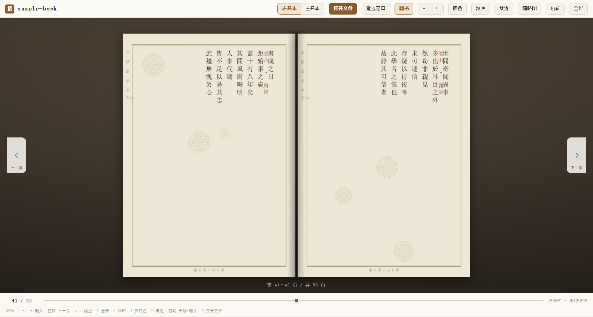
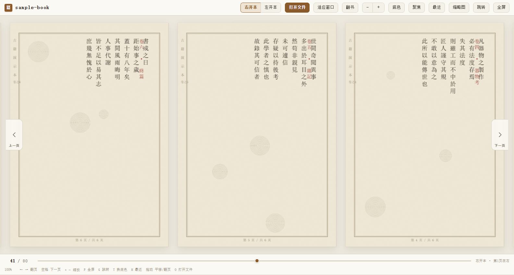

# 右翻书古籍阅读器（右开本 / 从右向左）

把古籍扫描文档按**古籍右开本**的方式阅读：第 1 页在最右侧，翻页时页面自右向左推进，
左右按钮可直接前后翻页。支持更换阅读底色（五种护眼配色）、手抓拖动、最近打开记录。

纯前端单文件应用：`index.html` + 自带的 pdf.js 本地副本，**不需要安装任何依赖**，
PDF 全程在浏览器本地解析，不上传任何服务器。

| 翻书模式（一屏一跨，像摊开的真书） | 连续滚动模式 |
| --- | --- |
|  |  |

## 请从固定入口打开（很重要）

**双击书库目录里的 `启动右翻书.bat`**，它会固定用 <http://127.0.0.1:8899> 打开阅读器。

为什么要强调「固定」：浏览器是**按地址**分开存数据的，下面这几个地址
在浏览器眼里是三个不同的网站，各存一套「最近打开」「阅读位置」「设置」，互不可见：

| 打开方式 | 地址 | 说明 |
| --- | --- | --- |
| 启动器（推荐） | `http://127.0.0.1:8899` | 数据存在这里，一直沿用 |
| 手打地址 | `http://localhost:8899` | **另一个网站**，看不到上面的记录 |
| 双击 index.html | `file:///…/index.html` | 又是一个网站；且不能读取本地书库清单 |

所以「昨天还能一键打开，今天打开记录却空了」几乎都不是文件坏了，而是换了入口。
启动器还有个好处：服务已在运行时，重复双击只会打开浏览器，不会重复起进程、更不会报错。

若确实想直接双击 `index.html`：功能都能用（已内置书库清单副本，不再白屏），
但阅读记录与离线缓存属于 `file://` 这个地址，换回 `127.0.0.1:8899` 就看不到。

## 怎么放自己的 PDF？三种方式，任选其一

### 方式一：直接拖进网页（最简单，推荐）

1. 双击 `启动右翻书.bat` 启动并打开阅读器
2. 把你的 PDF **拖到浏览器窗口里**，松手即可开始阅读

也可以点顶栏的 **打开文件** 按钮（或按 `O` 键）选择文件。

> 文件全程在浏览器本地解析，**不会上传到任何服务器**。

### 方式二：让脚本预先转换成本地数据

适合书比较大（几百页）、想反复打开的情况，转换一次之后秒开：

```bat
build.bat "C:\古籍\某某藏书.pdf"
```

转换结果存在 `data/`，之后双击 `start.bat` 就能直接读。

### 方式三：批量放图片

把一个装满页面图片的文件夹直接拖进网页，或：

```bat
build.bat "C:\古籍\扫描图目录"
```

## 核心特性

| 需求 | 实现方式 |
| --- | --- |
| 页面顺序从右向左 | 页面数组始终按「第 1 页在前」的自然顺序存放，左右摆位由**装帧方向**决定：右开本时第 1 页落在最右一格，自右向左推进 |
| 画质不损失 | 路径上**没有任何有损压缩环节**：PDF 页按 300 DPI 无损渲染并输出 PNG；图片页为**原文件原样引用**（不重新编码、不缩放） |
| 左右按钮翻页 | 屏幕左侧永远「上一页」、右侧永远「下一页」，与装帧方向**无关**；另有键盘 ← →、空格/PageUp/PageDown、触屏左右滑动 |
| 滚动条也从右向左 | 放大后滚动条跟随装帧方向：右开本滑块停在最右端，往左拖往后读 |
| 阅读底色可选 | 五套护眼配色（宣纸 / 豆沙绿 / 米黄 / 青灰 / 深褐），顶栏「底色」按钮或 `T` 键切换，选择被记住 |
| 聚焦一页/两页 | 可选开关 + 范围：一页档只让当前页清晰，两页档让当前跨的两页都清晰，两侧页面轻微虚化变淡，翻页自动跟随；顶栏「聚焦1页 / 聚焦2页」按钮或 `X` 键循环，选择被记住 |
| 翻书模式 | 像真书一样摊开 + 翻页动画，**任何一页都保持完整原页**：一页里印着左右两面书的对开扫描整张居中独占一屏（书脊落在图宽正中，不拆分）；单页扫描两两配跨，先读页在右、次读页在左，两侧都有纸；一次翻一跨，顺序不打乱；顶栏「翻书」按钮或 `B` 键切换，选择被记住 |
| 手抓拖动 | 按住页面直接拖。未缩放时拖动翻页，放大后拖动平移画布，松手自动吸附 |
| 最近打开 | 顶栏「最近」按钮或 `H` 键，列出最近读过的书、上次读到第几页，可一键续读与单条删除；导入过的书（含拖入的）凭句柄或本地缓存一键重开 |
| 大文档稳定 | 百页级 PDF 不会中途变空白：逐页渲染、逐页释放，单页失败不影响其余页面；单页超过 16MP 自动降采样、大页改用高质量 JPEG 输出，一二百页的大部头扫描件内存占用只有以前的几分之一 |
| 秒级开门 | PDF 导入只解析结构与页面尺寸（秒级），先渲染当前页即开门；其余页面由后台队列补齐，翻到哪页就优先渲染哪页，格子按真实宽高比预留、不跳版 |
| 静默故障自愈 | 每秒体检一次视图状态：翻书视图空白就自动重摆、连续视图页面丢失就自动重建、视图属性漂移就自动复位。缺页需连续两轮体检成立才动手（约 2.4 秒），单次瞬态不弹窗打扰；自愈记录带证据细节（哪一页、哪个槽位），`gushiReader.diag()` 可导出；未捕获错误在右上角小浮层可见，不再无声吞掉 |

### PDF 懒渲染是怎么回事

拖入 PDF 后不再等整本渲染完才开门（80 页的书以前要干等一两分钟）：

1. **解析（秒级）**：只读文档结构和每页宽高比，不做像素渲染；
2. **开门**：先把当前页渲染出来（一两秒），书就打开了，其余格子显示转圈占位；
3. **后台补齐**：按顺序逐页渲染，每页之间让出主线程，不卡界面；
4. **翻页插队**：翻到未渲染的页时，该页（含相邻页）立即优先渲染，不必排队。

换书时上一本的解析文档会被销毁，内存不会随着看书数量累积。

## 阅读底色

点顶栏 **底色** 按钮展开配色面板，或连按 `T` 键循环切换。

| 配色 | 适用场景 |
| --- | --- |
| **宣纸** | 默认。暖白偏黄，最接近古籍用纸 |
| **豆沙绿** | 经典护眼色，降低蓝光刺激 |
| **米黄** | 柔和暖黄，适合长时间阅读 |
| **青灰** | 冷调低饱和，环境光偏暖时更舒服 |
| **深褐** | 暗色主题（不用纯黑），夜间不刺眼 |

选择会自动记在本机（localStorage），下次打开沿用上次的配色。
面板外任意处点击、或按 `Esc` 可收起面板。

## 聚焦（一页 / 两页）

顶栏有 **聚焦1页** 和 **聚焦2页** 两个按钮，也可以按 `X` 键在 **关 → 一页 → 两页** 之间循环。开启后：

- **一页档**：只有正在读的那一页保持清晰；
- **两页档**：当前「跨」里的页都清晰 —— 对开扫描是整张，配对单页是左右两张，
  与翻书模式一屏摊开的范围一致，看跨页表格时不会有一条边被虚化；
- 两侧页面轻微虚化、变淡，眼睛自然落在当前范围上；
- 翻页时清晰页自动跟着走，两侧页的页码标签保持可读；
- 开关与范围都记在本机，下次打开自动沿用。

再次点击当前档位按钮（或循环到「关」）即恢复全部页面同等清晰。

## 翻书模式

点顶栏 **翻书** 按钮或按 `B` 键开关。开启后像看一本**摊在桌上的真书**：
一屏摊开一「跨」，两侧都有纸，翻页时一张纸绕书脊转过去。
**任何一页都保持完整原页：不裁切、不拆分、不重排**，页面顺序永远和原 PDF 一致。

- **一页里本来就印着左右两面书的对开扫描（宽高比 ≥ 1.15）整张独占一屏**：
  居中铺开、书脊落在图宽正中，绝不拆成两页 —— 拆开会打乱原书顺序；
  不裁切、不变形，画质原样保留；
- **单页扫描两两配成一跨**：右开本先读页在右、次读页在左（左开本反之），
  就像实体书摊开时左右各有一页；
- **一次翻页 = 一跨**：翻过去的那张纸，背面正好是接下来该读的那一面；
  前进后退方向随装帧方向自动镜像；
- 点阅读区左右侧、`←`/`→`、滚轮、手抓拖动、滑块、跳转全部照常可用，
  页码进度与连续模式完全共用，随时来回切；
- 只有原 PDF 就只有一页时，这一页整张居中摆放；
- 开关状态记在本机，下次打开自动沿用。

翻书模式按适应高度摆纸（对开页铺开也不会横向溢出窗口），不支持缩放；
需要放大看细节时按 `B` 切回连续模式即可。

## 装帧方向

顶栏可在两种装帧方向之间切换：

| 方向 | 含义 |
| --- | --- |
| **右开本**（默认） | 古籍装帧。第 1 页在最右端，翻页时页面自右向左推进 |
| **左开本** | 现代装帧。第 1 页在最左端，自左向右推进 |

无论选哪种，**左侧按钮永远是「上一页」、右侧按钮永远是「下一页」**，
键盘 `←` `→` 与触屏滑动的语义也固定不变——装帧方向只改变页面在屏幕上的摆放与滑动方向。

### 滚动条方向

用 `+` 放大后，阅读区变成可横向滚动。**滚动条也跟随装帧方向**：

- **右开本**：滑块起步停在**最右端**（此刻看到的正是第 1 页），
  往**左**拖才是往后读，一路拖到最左端就是末页。
- **左开本**：滑块起步在最左端，往右拖往后读。

这样滚动方向与翻阅线装书的手感一致。
按 `0`（或点「适应窗口」）回到单页居中模式，滚动条消失。

### 页面定位（第 1 页该出现在哪一端）

打开书、放大、翻页时，「第 1 页」和「滚动条」的位置必须对得上，
否则就会出现"滑块停在半路、第一页要自己拖出来"这种别扭感。为此做了三件事：

1. **纸面宽度按原始比例预留，不等图片下载完。**
   一开始宽度是由 `` 自己撑出来的：图片没到位时宽度接近 0，
   整条轨道就"变窄"了，于是算出来的滚动范围也是错的。实测过一个极端例子——
   图片未加载时算出 `maxScroll = 0`，图片到齐后真实值是 `2770`，
   而 `scrollLeft` 还停在 `0`，**右开本的第 1 页（最右端）被整个挤出视野**。
   现在 `render()` / `applyScale()` 直接用清单里的 `w`、`h` 预留宽度，
   第一帧的几何就是对的，图片后到也不影响。

2. **布局一变就重新归位。** 外加一道 `ResizeObserver` 兜底：
   只要轨道宽度发生变化，就把当前页重新贴回该在的位置。
   用户自己滚过（滚轮 / 按住拖动）之后就不再插手，尊重他找好的位置。

3. **居中模式的坐标基准修正。** `#track` 上有 `will-change:transform`，
   它因此成了包含块，`offsetLeft` 是相对轨道量的、不含轨道自身的位置；
   而内容比窗口宽时，`justify-content:center` 会把轨道摆到负位置
   （6 页的书实测 `-643px`）。少算这一段，当前页就会整整偏出这么多 ——
   表现为书页贴在左边、右边空一大片。补上之后实测偏差 1px。

另外，贴在「阅读起点」那一端时页码固定认作第 1 页：
窗口够宽时一屏常能同时容下第 1、2 页，若一律取"更靠后的那一页"，
刚打开书就会显示成第 2 页。

## 手抓拖动

按住阅读区任意位置直接拖，光标会变成抓握手型。**同一个手势，按当前模式分流**：

| 当前模式 | 拖动的作用 |
| --- | --- |
| **单页居中**（未放大） | 拖动**翻页**：往左拖 = 下一页，往右拖 = 上一页。拖不够长就弹回原页 |
| **放大后**（可滚动） | 拖动**平移画布**：手指往哪拖，内容跟着往哪走 |

平移方向与装帧方向一致——右开本下**把纸往右拉，下一页从左边进来**，跟翻线装书的手感一样。

鼠标、触屏、触控笔都支持（统一走 Pointer Events）。区分逻辑：

- 拖动距离小于 6px 视为点击，不触发拖动
- 首次移动锁定主轴，**纵向拖动不会翻页**（留给原生滚动）
- 拖动结束后会忽略随之而来的 `click`，避免拖完又顺带翻一页

> 一个容易踩的坑：缩放后视野里通常同时有 2~3 页（实测 668px 的页放在 1416px 的
> 视野里只占 47%）。所以判断"当前在看哪一页"时，**分母必须是页面自身宽度而不是
> 视野宽度** —— 用后者会得出"没有任何一页露出过半"的结论，判定全盘失效。
> 松手后的吸附也只在这种"两页都只看得到一小半"的情况下才触发，
> 拖动浏览时不会被强行拽回居中。

## 最近打开

点顶栏 **最近** 按钮或按 `H` 键展开。列表按时间倒序，每项显示书名、相对时间、
总页数与**上次读到的页码**，当前正在读的那本会高亮。

- **点一下就能续读**。翻页时进度会自动写回（300ms 防抖），刷新或关掉浏览器都不丢。
- **重新打开这本书会接着上次的位置继续**，不用每次从第 1 页翻起。
- 每项右侧 `×` 单独移除，右上角「清空」清空全部记录（**只清记录，不删任何书籍文件**）。
- 最多保留 12 条。

> **本机文件的一键重开**：所有导入过的书都可在「最近打开」里一键重开，重选文件只在极少数情况下才会出现。机制分两层：
> - **「打开文件」按钮**选择的书：浏览器把**文件句柄**（File System Access API）存进本机
>   IndexedDB，重开时直接读磁盘上的当前文件，最多弹一次授权确认；
> - **拖进窗口**的书：拖放拿不到句柄，但会把**文件本体存进本机缓存**（IndexedDB，
>   单本上限 1GB），重开时从缓存取回原文件重新走导入流程，**零授权、完全无感**。
>   PDF 依旧按 300 DPI 重新渲染，画质路径不变。
>
> 只有当句柄与缓存都不可用（书是在缓存功能上线前导入、浏览器数据被清理、文件超过
> 1GB 未缓存等）时，才会提示重新选择文件；重选一次后即可恢复一键直达。
> 若句柄指向的文件被移动、改名或删除，会明确提示「找不到原来的文件」。
>
> 用 `build.bat` 预转换过的书（页面存在 `data/` 里）记录的是相对路径，
> 点击即可直接打开，无需再选文件。
>
> 隐私说明：句柄与文件缓存只存在本机浏览器（IndexedDB）里，不上传任何服务器；
> 「最近打开」里删除单条记录或清空记录时，对应的缓存会一并删除；被挤出列表的
> 旧记录的缓存也会自动清理，不会一直占用磁盘。

> **点「打开文件」没反应？** 该按钮有两条通道：优先用浏览器原生的 `showOpenFilePicker`
> （好处是能拿到可持久化的**文件句柄**），但它在不少环境里根本不可用——旧浏览器、
> 局域网 http 访问（非安全上下文）、以及被别的网页用 iframe 嵌起来时（Chrome 会直接抛
> `SecurityError: Cross origin sub frames aren't allowed to show a file picker`）。
> 这些情况下会自动改用 `<input type="file">`，选择体验完全一致，只是拿不到句柄
> （有文件本体缓存托底，「最近打开」依然能一键重开）。失败原因会被记下并在本会话内
> 永久切换通道，不会反复抛错。想确认当前走的是哪条：控制台执行 `gushiReader.pickInfo()`。

> 实现说明：没有用 `transform:scaleX(-1)` 镜像或 `direction:rtl` 这类 CSS 花招——
> 实测前者会把 `scrollWidth` 算坏、后者会让 `scrollWidth - clientWidth` 直接变成 0
> （内容不再溢出，等于把滚动功能弄没了）。最终做法是保持布局与原生滚动完全正常，
> 只把「滚动条位置」与「内容位置」的对应关系交给 JS 管理，并把起点定位到方向那一端。

## 目录结构

```
gushi-reader/
  index.html            # 阅读器本体（单文件，双击即可用，支持拖放 PDF）
  vendor/
    pdfjs/              # PDF 解析库（本地副本，随程序一起分发；断网也能用）
      pdf.min.js
      pdf.worker.min.js
      LICENSE           # pdf.js 的 Apache-2.0 许可证
  data/
    manifest.json       # 页面清单（pages 数组为第 1 页在前的自然顺序）
    manifest.embed.js   # 同一份清单的 <script> 副本（file:// 直开时用，构建脚本自动生成）
    pages/              # 页面图片
  docs/
    screenshot-*.png    # README 用截图（由 tools/_shot_docs.mjs 拍摄）
  tools/
    build_reader.py     # 把 PDF / 图片预转换成阅读器数据
    make_demo_scan.py   # 生成演示用竖排扫描页
    make_test_pdf.py    # 生成 6 页测试 PDF
    make_big_pdf.py     # 生成 80 页大 PDF（用于验证大文档稳定性）
    make_mixed_pdf.py   # 生成含对开页/单页的混合测试 PDF
    serve.mjs           # 固定入口本地服务（127.0.0.1:8899，已在跑就只开浏览器）
    render_check.mjs    # 无头浏览器渲染 + 方向模型 + 底色面板验证
    upload_check.mjs    # 拖放上传功能验证
    interact_check.mjs  # 交互端到端验证（底色/大 PDF/翻页/方向/滚动）
    gesture_check.mjs   # 手抓拖动 + 最近打开历史验证
    _diag_*.mjs         # 单功能的专项断言脚本（聚焦 / 重开 / 缓存 / 打开文件 / 翻书 / PDF 通道 / 入口 / 看门狗，见「验证」）
  .nojekyll             # GitHub Pages：跳过 Jekyll，vendor/ 与 tools/ 原样可访问
  .gitignore
  .gitattributes        # .bat 强制 CRLF（cmd 对 LF 换行的批处理会解析错位）
  build.bat             # 一键构建
  start.bat             # 启动逻辑（固定入口，供下面的 bat 调用）
  启动右翻书.bat         # ← 平时双击这个
  LICENSE               # MIT
```

> **把阅读器拷给别人用**：`index.html` + `vendor/` 必须一起拷（`data/` 是书的内容）。
> `vendor/pdfjs/` 是 PDF 解析库的本地副本，缺了它就只能靠联网从 CDN 取——
> 断网或 CDN 被拦时就打不开 PDF 了。要连启动器一起给，就再带上
> `start.bat`、`启动右翻书.bat`、`tools/serve.mjs`（对方需要有 Node.js）。

## 打开阅读器

**Windows**：双击 `启动右翻书.bat`。

**macOS / Linux**：`node tools/serve.mjs`（需要 Node.js 18+）。

两种方式都固定用 `http://127.0.0.1:8899` 打开——这是「最近打开」「阅读位置」
「设置」的存放地。服务已在运行时重复启动，只会再打开一次浏览器，
不会报错、不会起第二个进程。（`start.bat` 是同一份启动逻辑，供上面那个 bat 调用。）

也可以直接双击 `index.html`：功能可用（书库清单有内嵌副本，不再白屏），
但那时数据存在 `file://` 名下，与 `127.0.0.1:8899` 互不相通；
页面顶部会有一条提示说明这件事，点右侧 × 可不再提示。

## 在线部署（GitHub Pages 等）

本项目是纯静态站点，可直接部署到任意静态托管（GitHub Pages、Vercel 等）：

1. 仓库根目录就是站点根目录，所有资源均为相对路径，子路径部署无需配置；
2. 仓库已含 `.nojekyll`，GitHub Pages 不会用 Jekyll 处理，`vendor/`、`tools/` 原样可访问；
3. 部署方法：仓库 Settings → Pages → Source 选 `main` 分支根目录即可。

注意：线上地址与本地 `127.0.0.1:8899` 是**两个不同的站点**，各自有独立的
「最近打开 / 离线缓存」；在线版浏览器只允许挑选文件（无法凭句柄重开），属正常限制。

## 验证

```bash
python tools/make_test_pdf.py      # 生成 6 页测试 PDF（首次）
python tools/make_big_pdf.py 80    # 生成 80 页大 PDF（首次）

node tools/render_check.mjs    # 磁盘模式：页序、方向映射、按钮语义、底色面板（22 项）
node tools/upload_check.mjs    # 拖放导入 PDF 全流程（20 项）
node tools/interact_check.mjs  # 交互端到端：底色 / 80 页大 PDF / 翻页 / 装帧方向 / 滚动方向（46 项）
node tools/gesture_check.mjs   # 手抓拖动 / 缩放平移 / 最近打开历史 / 页面定位与滚动起点（76 项）
node tools/_diag_origin.mjs    # 入口与存储：地址隔离 / file:// 直开 / 环境自检 / 启动器幂等（13 项）
node tools/serve.mjs --no-open # 起固定入口服务（http://127.0.0.1:8899/）
```

另有一组按功能逐项断言的专项脚本（都自包含 CDP，随改随跑）：

```bash
node tools/_diag_focus.mjs     # 聚焦一页/两页：开关 / 范围切换 / 类名跟随 / 计算样式 / 按钮与 X 键 / 持久化（28 项）
node tools/_diag_reopen.mjs    # 最近打开：句柄读写删 / 列表文案 / 失效兜底（12 项）
node tools/_diag_cache.mjs     # 拖入书：导入即缓存 → 从最近点开免重选全链路（12 项）
node tools/_diag_pick.mjs      # 打开文件：通道选择与失败降级（picker / input）（26 项）
node tools/_diag_book.mjs      # 翻书模式：跨划分、左右摆位、翻页动画、对开页、方向镜像（59 项）
node tools/_diag_cross.mjs     # 翻书模式跨专项：配对 / 对开 / 落单 / 单页书的布局与翻跨
node tools/_diag_pdf_open.mjs  # PDF 导入通道与「最近」重开：本地库 / CDN 被拦 / 缺库提示（19 项）
node tools/_diag_watchdog.mjs  # 看门狗自愈：瞬态缺页不打扰 / 持续缺页自愈并留证据（7 项）
```

脚本都用无头浏览器加载真实页面并读取 DOM，并用 CDP 派发真实事件，
不做静态猜测。`interact_check.mjs` 会实际把 80 页 PDF 拖进页面，
逐页确认 `naturalWidth > 0`（即真的渲染出图像，而非空白），
并按 1/3 页宽的步长拖动滚动条，验证页码单调递增经过全部 80 页、无跳页。

`gesture_check.mjs` 用真实的 `PointerEvent` 序列（`pointerdown` → 多次
`pointermove` → `pointerup`，再补发一次 `click`）复现拖动手势，逐项核对
光标形态、`grabbing`/`dragging` 类、主轴锁定、滚动位置与页码变化——
用 `MouseEvent` 派发是**不会**触发页面的指针监听的，那样测试会假通过。

其中最后一节会把页面图片的请求整个拦掉，**逼出"布局先于图片"的场景**，
专门验证第 1 页与滚动条的起点不会被图片的迟到带偏——
这正是"滑块停在半路、第一页要自己拖出来"那个故障的复现条件。

> **跑测试前先确认 8961 / 9481 端口空闲。** 测试进程若被强制中断（超时、
> Ctrl-C），可能残留一个持有端口的 `node.exe` 与一个 `msedge.exe`，
> 后续运行会立刻以 `EADDRINUSE` 失败，看起来像是代码坏了。
> 用 `netstat -ano | findstr "8961 9481"` 找到 PID 后结束即可。

## 注意事项

- **PDF 解析库已改为本地自带，断网可用**：`vendor/pdfjs/` 里的两个文件随程序分发，
  页面打开时预热本地副本；万一这个目录缺失，会自动退回 CDN 取。
  两条路都不通时导入会弹出说明原因的提示（不会再出现"点了没反应、什么都看不到"），
  控制台执行 `gushiReader.pdfInfo()` 能看到当前用的是哪一路。图片导入不需要它。
- 拖放导入的页面存在内存里，**刷新页面即清空**，不会写入磁盘。
  想让某本书长期保留，用 `build.bat` 预转换一次即可。
- 拖放导入采用懒渲染：页面图片渲染完成后才驻留内存。超大开本扫描件
  （数百页）建议用 `build.bat --max-width` 预转换，或分批阅读，以降低浏览器内存压力。
- 若个别页面渲染失败，对应格子会显示「本页渲染失败」并有提示浮出，
  不会静默变成空白页。

## 阅读器快捷键

| 按键 | 作用 |
| --- | --- |
| `←` / `A` | 上一页 |
| `→` / `D` | 下一页 |
| `空格` / `PageDown` | 下一页 |
| `Backspace` / `PageUp` | 上一页 |
| `Home` / `End` | 首页 / 末页 |
| `+` / `-` / `0` | 放大 / 缩小 / 适应窗口（放大后可横向滚动） |
| `F` | 全屏 |
| `G` | 跳转指定页 |
| `T` | 循环切换阅读底色 |
| `X` | 聚焦循环：关 → 一页清晰 → 两页清晰 |
| `B` | 翻书模式：像摊开的真书一样左右各一页 + 翻页动画 |
| `O` | 打开本机 PDF / 图片 |
| `Esc` | 关闭弹层 / 收起底色面板 |

## 画质说明

两种导入方式都避开有损环节：

**拖进网页 / 打开文件**

- PDF：用 pdf.js 以 300 DPI 栅格化（上限 5 倍，避免超大页面撑爆内存）。
  单页 ≤ 400 万像素时输出 **PNG**（无损）；更大的页自动降采样到 16MP 上限，
  并改用 **JPEG 质量 0.9** 输出——扫描件源图本身就有损，这个档位肉眼无差别，
  而体积只有 PNG 的十分之一上下，一二百页的大部头才不会把内存吃满。
- 图片：直接用 `File` 对象建立 `blob:` 地址，**零重编码**，像素与原文件完全一致。

**命令行预转换（build_reader.py）**

- PNG / BMP / TIFF 输入：**原样复制**，逐字节不变。
- JPEG 输入：**原样复制**，不做二次编码。
- PDF 输入：使用 PyMuPDF 以无损方式导出整页图像（flate 编码 PNG，无降采样、无质量参数）。
  默认按 PDF 内嵌图像的原生分辨率导出，因此不会损失细节；DPI 参数仅作兜底使用。

如果希望体积更小，可在构建时加 `--max-width`（例如 `--max-width 2400`）向下缩放，
但**这属于有损缩放，默认关闭**。

## 许可

本项目代码以 [MIT](LICENSE) 许可发布。

### 第三方组件

| 组件 | 用途 | 许可 |
| --- | --- | --- |
| [pdf.js](https://github.com/mozilla/pdf.js) 3.11.174 | PDF 解析与渲染（`vendor/pdfjs/` 本地副本，附带其 [LICENSE](vendor/pdfjs/LICENSE)） | Apache-2.0 |

演示书页与测试 PDF 均由脚本合成（`tools/make_demo_scan.py` 等），不含任何真实馆藏扫描件。
